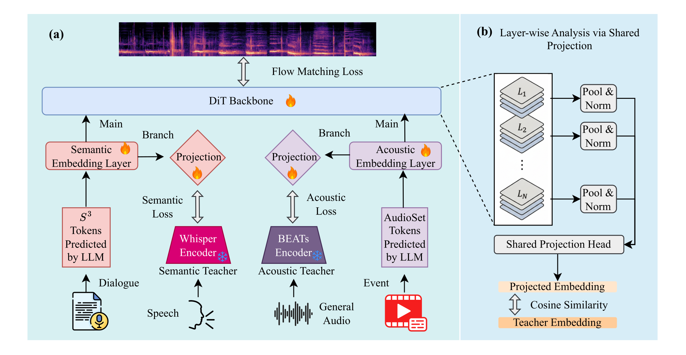
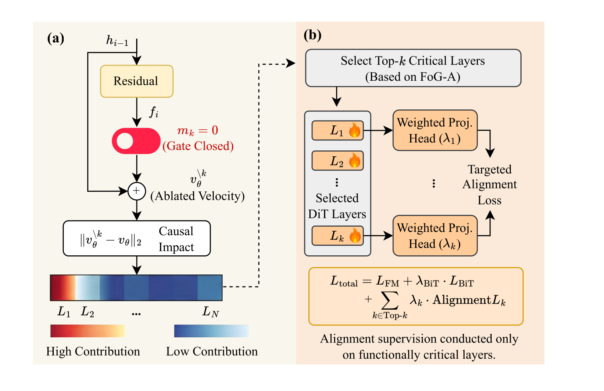
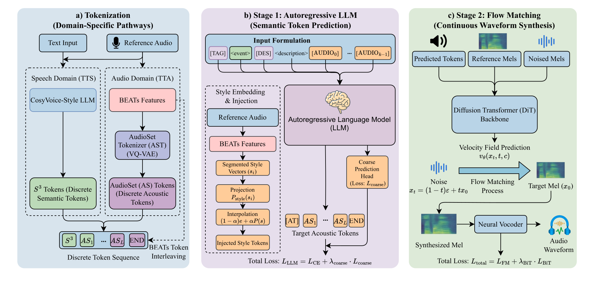

# AG-REPA: Alineación de Representaciones Guiada por Atribución para Flow Matching en Audio

> Código oficial del artículo
> **"AG-REPA: Causal Layer Selection for Representation Alignment in Audio Flow Matching"**
> *Pengfei Zhang, Tianxin Xie, Minghao Yang, Li Liu.* — ICML 2026.

> 📄 **Paper & poster:** [ICML 2026 Virtual](https://icml.cc/virtual/2026/poster/65899)
> &nbsp;|&nbsp; 🌐 **Language:** English | [简体中文](README.zh-CN.md)

Un marco unificado de generación de audio que realiza ambas tareas **Text-to-Speech (TTS)** y
**Text-to-Audio (TTA)** con una única estructura base de Flow-Matching. Este repositorio contiene el
**código de entrenamiento, diagnóstico e inferencia**, junto con la herramienta de interpretabilidad
(**BiT-C / LASP / FoG-A**) y la estrategia de entrenamiento **AG-REPA** del artículo.

**La idea en una línea:** el REPA estándar alinea las capas que *almacenan* la mayor información;
AG-REPA alinea las capas que *realmente impulsan* la salida — encontradas automáticamente por una
sonda causal — reduciendo la distancia de Fréchet de audio en **18 % (habla) / 16 % (audio)**
respecto a la línea base de mejor REPA de capa fija.

> ℹ️ **Este repositorio es solo código** — no incluye puntos de referencia ni conjuntos de datos. Los pesos preentrenados y artefactos de diagnóstico están en Hugging Face: **[🤗 AustinZhang/AG-REPA](https://huggingface.co/AustinZhang/AG-REPA)**.
> Los modelos base congelados (BEATs, CosyVoice) se descargan de sus fuentes originales — consulte la tarjeta del modelo.

---

## 🔊 Muestras de audio — AG-REPA vs. línea base (un solo codebook, 1 época)

Para hacer el efecto *audible*, los clipes a continuación provienen de dos modelos entrenados durante **solo una
época** en el **codebook principal único** (Config A) — uno **sin** AG-REPA (línea base) y
uno **con** AG-REPA, todo lo demás idéntico. Después de una sola época, el modelo AG-REPA ya es
claramente más limpio y estable, mientras que la línea base aún es ruidosa y
no ha convergido — una señal directa y audible de que AG-REPA **acelera el entrenamiento y estabiliza
la calidad**.

**🗣️ TTS — habla de cero-shot**

❌ *Línea base — sin AG-REPA (1 época):*

https://github.com/user-attachments/assets/9d084624-dc6d-4f13-98ae-95d5367aac3e

✅ *AG-REPA (1 época):*

https://github.com/user-attachments/assets/4844662d-aafb-489d-9b04-dcf62c8d03bb

**🔊 TTA — audio general**

❌ *Línea base — sin AG-REPA (1 época):*

https://github.com/user-attachments/assets/10fa3c94-8f70-4f89-a20b-13c734e6b1d3

✅ *AG-REPA (1 época):*

https://github.com/user-attachments/assets/04c1daf8-a976-4732-b3d0-0698b77f0e1b

> ▶ Los clipes se reproducen *en línea* — solo presione play, sin descarga. Son muestras de
> una época, codebook único que muestran *convergencia en entrenamiento temprano* (no calidad final): incluso
> después de una época, AG-REPA ya es más limpio y estable que la línea base. Archivos WAV sin pérdida:
> TTS [línea base](assets/audio/tts_no_agrepa.wav) / [AG-REPA](assets/audio/tts_agrepa.wav) ·
> TTA [línea base](assets/audio/tta_no_agrepa.wav) / [AG-REPA](assets/audio/tta_agrepa.wav).
> Calidad totalmente entrenada: [paper](https://icml.cc/virtual/2026/poster/65899) ·
> [tarjeta del modelo 🤗](https://huggingface.co/AustinZhang/AG-REPA).

---

## ⚡ Comenzando rápido (inferencia en 3 pasos)

Genere audio con los pesos publicados de AG-REPA. Para entrenar desde cero en su lugar, vaya a
[§5 Instalación](#5-instalación) → [§7 Entrenamiento](#7-tubería-de-entrenamiento).

```bash
# 1) Entorno
conda create -n agrepa python=3.10 -y && conda activate agrepa
pip install -r requirements.txt

# 2) Descargue los pesos y enlace con un directorio variante (mapa completo en §9)
hf download AustinZhang/AG-REPA --local-dir AG-REPA-Model
cd Fusion_single_codebook
ln -s /path/to/pretrained_base_models pretrained_models          # BEATs + CosyVoice, vea la tarjeta del modelo
mkdir -p checkpoints
ln -s /path/to/AG-REPA-Model/flow_matching/agrepa_single_codebook checkpoints/flow

# 3) Sintetice (TTS zero-shot, voz clonada a partir de un clip de referencia)
python inference_tts.py \
    --text "This is a classic line from Blade Runner." \
    --prompt_wav ./wav/english_male.flac \
    --checkpoint_dir ./checkpoints/flow \
    --cosyvoice_model_dir ./pretrained_models/CosyVoice-300M \
    --output ./output/generated_tts.wav --speed 0.9 --gpu_id 0
```

**¿Nuevo?** Lea [§1](#1-que-problema-resuelve-ag-repa) para *qué hace AG-REPA*,
[§4](#4-estructura-del-repositorio--los-cuatro-variantes) para *elegir el variante correcto*, y
[§8](#8-inferencia)–[§9](#9-conectar-los-pesos-del-modelo-con-el-código) para los detalles completos de inferencia y
enlace de pesos.

---

## 1. ¿Qué problema resuelve AG-REPA?

La Alineación de Estados Intermedios (REPA) acelera el entrenamiento de modelos generativos Flow-Matching
alineando los estados ocultos intermedios de una red con características preentrenadas congeladas.
Sin embargo, solo funciona si se alinean las **capas correctas** — y el trabajo previo las elige
*Heuristicamente* (p. ej. "siempre alinear el bloque medio / capa 8").

El artículo muestra que esta heurística está mal dirigida para **Flow-Matching condicionado a tokens en audio**, debido a lo que llamamos **Descoordinación Almacenamiento-Contribución (SCD)**:

* **Almacenamiento — lo que la red *sabe*.** Las capas profundas (L20–L24) conservan la información
  semántica/acústica más rica (alta similitud con el profesor).
* **Contribución — lo que la red *usa*.** Las capas superficiales (L1–L3) y una banda de fase media
  (L6–L12, alrededor del tiempo de difusión *t≈0.5*) son lo que realmente impulsa el campo de velocidad predicho.

Estos dos conjuntos **no se superponen**. Por lo tanto, alinear las capas profundas ricas en información (REPA estándar)
termina supervisando capas que son "ricas pero funcionalmente pasivas". **AG-REPA**
en su lugar alinea las capas *causalmente dominantes*, seleccionadas automáticamente por una sonda de atribución causal de solo hacia adelante.

**Resultado:** AG-REPA reduce la Distancia de Fréchet de Audio (FAD) en **18 % (habla)** y
**16 % (audio)** frente a la línea base de mejor REPA de capa fija, y se transfiere entre las arquitecturas
Voicebox, CosyVoice y F5-TTS.

---

## 2. La herramienta de interpretabilidad & AG-REPA en una imagen

| Sonda | Pregunta que responde | Qué mide |
|-------|---------------------|------------------|
| **BiT-C** (Bi-Stream Teacher Cosine) | *¿Está alineada la interfaz de conditionamiento con ambas modalidades?* | Similitud coseno de las representaciones de la capa 0 con los profesores **Whisper** (habla) y **BEATs** (audio). |
| **LASP** (Layer-wise Analysis via Shared Projection) | *¿Qué sabe cada capa **?*** | Similitud coseno de la representación promediada de cada capa con el profesor, a través de una única cabeza de proyección congelada compartida (Almacenamiento / "Cos-SEM", "Cos-EVT"). |
| **FoG-A** (Forward-only Gate Ablation) | *¿Qué usa cada capa **?*** | Cambio normalizado en el campo de velocidad predicho cuando se desactiva la contribución residual de una capa (Contribuye). |

<p align="center">
  
</p>
<p align="center"><sub><b>Diagnosticando almacenamiento de representaciones.</b> (a) <b>BiT-C</b> ancla la interfaz de conditionamiento a los profesores <b>Whisper</b> (semántico) y <b>BEATs</b> (acústico) congelados; (b) <b>LASP</b> sonda "lo que sabe cada capa" proyectando cada capa en un espacio compartido de profesor y midiendo similitud coseno.</sub></p>

**AG-REPA** luego (i) clasifica las capas por atribución causal de FoG-A y conserva las **Top-K**, y
(ii) adjunta una proyección MLP ligera por capa con un
**peso proporcional a la atribución** `λ_k ∝ FoG-A_k` — de modo que la pérdida de alineación se aplica solo
donde realmente importa causalmente. Aquí `K = 3`; las capas seleccionadas por la sonda son:

* **Habla (profesor Whisper):** capas **L1, L9, L5** → `λ ≈ {0.334, 0.139, 0.118}`
* **Audio (profesor BEATs):** capas **L1, L21, L9** → `λ ≈ {0.278, 0.120, 0.112}`

(Estos coinciden exactamente con la Tabla 1 / Ecuación 11 del artículo y están codificados de forma rígida en
`REPA_*/models.py`.)

<p align="center">
  
</p>
<p align="center"><sub><b>De la atribución causal a la optimización.</b> (a) <b>FoG-A</b> desactiva la contribución residual de cada capa y mide el cambio inducido en el campo de velocidad, produciendo un mapa de importancia causal (rojo = alta contribución). (b) <b>AG-REPA</b> aplica la supervisión de alineación <em>solo</em> a las capas críticas causalmente seleccionadas, cada una a través de una cabeza de proyección con peso proporcional a su puntaje de atribución <code>λ_k</code>.</sub></p>

---

## 3. Arquitectura del sistema

Un cascada de dos etapas divide la planificación semántica de alto nivel de la renderización acústica de bajo nivel
(Anexo A del artículo):

<p align="center">
  
</p>
<p align="center"><sub><b>El marco unificado de generación de audio.</b> (a) La tokenización específica del dominio produce una secuencia discreta unificada (tokens S³ para habla, tokens AudioSet para audio, opcionalmente intercalados con tokens BEATs); (b) un modelo LLM autoregresivo Stage-1 predice los tokens acústicos objetivo con inyección de estilo de referencia; (c) un modelo DiT Flow-Matching Stage-2 sintetiza el espectrograma mel, decodificado a una forma de onda por el decodificador Vocos.</sub></p>

La misma línea base como un esquema textual:

```
                 ┌──────────────────── Etapa 1: LLM Autoregresivo ───────────────────┐
 text + ref ───► │  Qwen3-0.6B-Base, afinado para predecir tokens acústicos discretos.   │
 audio           │  Estilo de referencia inyectado vía incrustaciones derivadas de BEATs; auxiliar   │
                 │  cabeza de predicción (coarse).                                  │
                 └─────────────────────────────┬──────────────────────────────────────┘
                                               │  tokens discretos (S3 para habla, AudioSet para audio)
                                               ▼
                 ┌──────────────────── Etapa 2: Flow Matching (DiT) ──────────────────┐
                 │  24 capas DiT con adaLN-Zero predice el campo de velocidad  │
                 │  v_θ(x_t, t, c) transportando ruido → espectrograma mel objetivo.        │
                 │  *** Aquí operan BiT-C / LASP / FoG-A / AG-REPA. ***      │
                 └─────────────────────────────┬──────────────────────────────────────┘
                                               ▼
                                   Vocos vocoder ──► forma de onda (24 kHz)
```

### Rutas de tokenización
* **Habla (tokens S³).** El `speech_tokenizer_v1.onnx` de CosyVoice produce tokens S³ semánticos (vocab 4096).
* **Audio (tokens AudioSet).** Un **AudioSet Tokenizer (AST)** — un VQ-VAE RepCodec entrenado en
  características **BEATs** — produce tokens acústicos discretos
  (vocab 4096), alineados con el vocabulario S³ para procesamiento downstream unificado.

---

## 4. Estructura del repositorio — los cuatro variantes

El lanzamiento incluye **cuatro variantes autoconcontenidas**, diferenciadas a lo largo de dos ejes:

|                | **Línea base + diagnóstico** (`Fusion_*`) | **Entrenamiento AG-REPA** (`REPA_*`) |
|----------------|------------------------------------------|----------------------------------|
| **Codebook único** (Config A: tokens S³ + AudioSet) | `Fusion_single_codebook/` | `REPA_single_codebook/` |
| **Codebook dual** (Config B: Config A **+ tokens BEATs intercalados**) | `Fusion_dual_codebook/` | `REPA_dual_codebook/` |

* **`Fusion_*` — el modelo diagnóstico / Fase-I.** Entrena el modelo FM con el objetivo estándar mientras ejecuta las
  **sondas de interpretabilidad** (`LayerProbeLogger`, `fog_attribution`, `probe_layers` en `models.py`). Produce los CSVs de atribución de capas y mapas de calor que reproducen **Figura 1 / Tabla 1** del artículo, y sirve como
  *línea base sin alineación*.
  > "Fusion" = el modelo que lleva la **herramienta de interpretabilidad fusionada** (BiT-C + LASP +
  > FoG-A). La captura terminal `COS_FOG.png` en la liberación del modelo es su salida Top-3.

* **`REPA_*` — el modelo Fase-II.** Partiendo del mismo estado posterior al warm-up, aplica
  **alineación intra-capas REPA guiada por atribución** en las capas seleccionadas por FoG-A
  (vea §2). AG-REPA toca **solo la etapa Flow-Matching** — la LLM Stage-1 se comparte con el
  variante correspondiente `Fusion_*` de la configuración del codebook.

* **`single` vs `dual` codebook.** Las variantes de codebook dual intercalan un token BEATs denso
  después de cada token principal (`s = [t1, b1, t2, b2, …]`, Ecuación 15), dando una
  manifold proxy más cercana al manifold acústico objetivo.

Esto sigue el protocolo estricto **sonda-luego-intervención** del artículo (Anexo A.5):
*Fase I (`Fusion_*`)* calcula y congela el conjunto Top-K de capas causales; *Fase II
(`REPA_*`)* entrena con alineación aplicada solo a esas capas.

### Archivos dentro de cada variante

| Archivo | Rol |
|------|------|
| `config.yaml` | Única fuente de verdad: rutas de datos, ajustes de audio/mel, y todos los hiperparámetros Stage-1/2. |
| `models.py` | `AudioSetTokenizer` (AST), `MelSpectrogramExtractor`, `DiTBlock`, `FlowMatchingModel`. En `Fusion_*` también expone `fog_attribution()` y `probe_layers()`; en `REPA_*` implementa las cabezas REPA por capa + ponderación λ. |
| `data_loader.py` | `LibriSpeechDataset` (habla) y `AudioSetDataset` (audio general). *(idéntico entre variantes)* |
| `extract_s3_tokens.py` | Pre-extrae tokens S³ de LibriSpeech en `speech_tokens/`. |
| `train_ast.py` | Etapa 0: entrena el AudioSet Tokenizer (VQ-VAE RepCodec en características BEATs). *(idéntico entre variantes)* |
| `train_llm.py` | Etapa 1: afina el LLM Qwen3-0.6B-Base (pérdidas de token + estilo + coarse). |
| `train_cfm.py` | Etapa 2: entrena el modelo DiT Flow-Matching. `Fusion_*` incluye el logger de sondas; `REPA_*` ejecuta el entrenamiento con alineación guiada por atribución. |
| `utils.py` | Carga de configuración + ayudas de normalización de picos de audio. *(idéntico entre variantes)* |
| `ds_config_{ast,cfm,llm}.json` | Configuraciones DeepSpeed ZeRO-1 para cada etapa de entrenamiento. |
| `cosyvoice/`, `beats/`, `repcodec/` | Codificadores/tokenizadores terceros vendidos bajo cada directorio variante o referenciados como profesores/modelos base. |
| `wav/` | Algunos clips de referencia pequeños para demos de inferencia. |
| `inference_tts.py`, `inference_tta.py` | **(Sólo en `Fusion_single_codebook/`)** Inferencia end-to-end TTS / TTA. |
| `generate_descriptions.py` | **(Sólo en `REPA_single_codebook/`)** Autoetiquetas clips de AudioSet con MiDashengLM-7B → `audioset_description.jsonl` (TTA texto conditionamiento). |

> Las cuatro variantes comparten mucho código: `train_ast.py`, `data_loader.py`, `utils.py` y
> las librerías terceo vendidas son idénticas entre todas; `models.py`, `train_cfm.py`,
> `train_llm.py` y `config.yaml` difieren por variante.

---

## 5. Instalación

```bash
# Se recomienda Python 3.10 (coincide con los .pyc / ruedas empacados).
conda create -n agrepa python=3.10 -y
conda activate agrepa

pip install -r requirements.txt

# Frontend de texto CosyVoice (opcional, solo para TTS con normalización de texto):
# instale las ruedas ttsfrd enviadas con el paquete modelo CosyVoice-ttsfrd
# (https://www.modelscope.cn/models/iic/CosyVoice-ttsfrd).
```

Luego obtenga los pesos preentrenados de **[🤗 AustinZhang/AG-REPA](https://huggingface.co/AustinZhang/AG-REPA)**
y enlace según §9.

---

## 6. Preparación de datos

Los modelos entrenan en **LibriSpeech** (habla, 960 h) + **AudioSet** (audio general). Ajuste las raíces del
conjunto de datos en `config.yaml` (`data.librispeech.*`, `data.audioset.*`), luego:

```bash
cd REPA_single_codebook            # o cualquier variante

# (a) Extraiga previamente los tokens S³ de LibriSpeech  ->  speech_tokens/
python extract_s3_tokens.py --config config.yaml \
    --dataset librispeech \
    --model ./pretrained_models/CosyVoice-300M/speech_tokenizer_v1.onnx \
    --save_dir speech_tokens --threads 16 --gpu_id 0

# (b) Genere descripciones en lenguaje natural para AudioSet  ->  audioset_description.jsonl
#     (solo presente en REPA_single_codebook/)
python generate_descriptions.py
```

---

## 7. Tubería de entrenamiento

Cada etapa se lanza con **DeepSpeed** (ZeRO-1) y lee sus hiperparámetros de `config.yaml` y el
`ds_config_*.json` correspondiente.

```bash
cd REPA_single_codebook            # elija la variante que desea entrenar

# Etapa 0 — Tokenizer AudioSet (VQ-VAE RepCodec en características BEATs)
deepspeed train_ast.py --config config.yaml

# Etapa 1 — LLM Autoregresivo (Qwen3-0.6B-Base; pérdidas de token + estilo + coarse)
deepspeed train_llm.py --config config.yaml

# Etapa 2 — Flow-Matching DiT backbone
#   * En Fusion_* esto también ejecuta las sondas BiT-C / LASP / FoG-A (Fase I).
#   * En REPA_* entrena con alineación REPA guiada por atribución (Fase II).
deepspeed train_cfm.py --config config.yaml
```

Los puntos de control llegan bajo `checkpoints/{ast,llm,flow}/`, y muestras de validación/visualización
bajo `outputs_cfm/`.

### Reproduciendo los diagnostics (Figura 1 & Tabla 1)

Ejecute **La Etapa 2 en una variante `Fusion_*`.** Durante la época de warm-up el `LayerProbeLogger`
escribe, por época, a `checkpoints/flow/`:

* `csv/probe_stats_epoch_XXXX.csv` — puntuaciones LASP (Cos-SEM / Cos-EVT) por capa almacenamiento.
* `csv/probe_stats_epoch_XXXX_foga.csv` — puntuaciones de atribución causal FoG-A por capa.
* `image/..._foga_heatmap.png` — el mapa de calor SCD spatiotemporal (Figura 1).
* `image/..._importance.png`, `image/..._trend_top3.png` — importancia por capa & Top-3
  estabilidad a través del entrenamiento (Tabla 7).

Las capas Top-K y `λ_k` leídas de estos CSV son exactamente lo que está codificado en las
`REPA_*` modelos para la Fase II.

---

## 8. Inferencia

Los scripts de inferencia end-to-end viven en **`Fusion_single_codebook/`**.

```bash
cd Fusion_single_codebook

# Text-to-Speech (zero-shot, voz clonada a partir de un clip de referencia)
python inference_tts.py \
    --text "This is a classic line from Blade Runner." \
    --prompt_wav ./wav/english_male.flac \
    --checkpoint_dir ./checkpoints/flow \
    --cosyvoice_model_dir ./pretrained_models/CosyVoice-300M \
    --output ./output/generated_tts.wav --speed 0.9 --gpu_id 0

# Text-to-Audio (sintetización de eventos sonoros condicionados en un tag + descripción)
python inference_tta.py \
    --event "Dog barking" \
    --desc "A medium-sized dog barking repeatedly in a quiet room" \
    --prompt_wav ./wav/dog.wav \
    --llm_ckpt_dir ./checkpoints --flow_ckpt_dir ./checkpoints/flow \
    --output ./output/generated_tta.wav --gpu_id 0
```

> Para sintetizar con el modelo **AG-REPA**, apunte `--checkpoint_dir` / `--flow_ckpt_dir`
> a un punto de control Flow-Matching de `AG-REPA-Model/flow_matching/agrepa_*`.

---

## 9. Conectar los pesos del modelo con el código

Descargue los pesos de Hugging Face (`hf download AustinZhang/AG-REPA --local-dir
AG-REPA-Model`) y los modelos base de sus fuentes originales. Cada directorio variante
espera estos subdirectorios — cree enlaces simbólicos o copie:

```
<variante>/
├── pretrained_models/        ←  BEATs + CosyVoice (descargue de fuentes upstream — vea la tarjeta del modelo)
│   ├── BEATs_iter3_plus_AS2M.pt
│   ├── CosyVoice-300M/
│   └── CosyVoice-ttsfrd/
└── checkpoints/
    ├── ast/                  ←  AG-REPA-Model/audioset_tokenizer/
    ├── llm/                  ←  AG-REPA-Model/llm/<single|dual>_codebook/
    └── flow/                 ←  AG-REPA-Model/flow_matching/agrepa_<single|dual>_codebook/
```

> La liberación Hugging Face incluye solo los puntos de control **finales AG-REPA** (`agrepa_*`, los
> `REPA_*` variantes). Las líneas base sin alineación y diagnósticos FoG-A/LASP no se incluyen
> — prodúzcalos entrenando las variantes `Fusion_*` con este código.

Ejemplo:

```bash
cd REPA_single_codebook
ln -s /path/to/pretrained_base_models                            pretrained_models
mkdir -p checkpoints
ln -s /path/to/AG-REPA-Model/audioset_tokenizer                  checkpoints/ast
ln -s /path/to/AG-REPA-Model/llm/single_codebook                 checkpoints/llm
ln -s /path/to/AG-REPA-Model/flow_matching/agrepa_single_codebook checkpoints/flow
```

Vea la [tarjeta del modelo 🤗](https://huggingface.co/AustinZhang/AG-REPA) para la tabla de mapa completo y enlaces de descarga de modelos base.

---

## 10. Principales knobs de configuración (`config.yaml`)

| Sección | Resumen |
|---------|-----------|
| `audio` | Entrada 16 kHz, 100 bins mel; `vocos` re-sintetiza a 24 kHz. |
| `hyperparameters.ast` | `vocab_size: 4096`, pérdidas de reconstrucción + VQ-commitment. |
| `hyperparameters.llm` | `Qwen/Qwen3-0.6B-Base`; `style_num_tokens (K)=16`, `style_strength (α)=0.5`, `style_dropout_p=0.7` (CFG); `coarse_num_clusters=128`, `coarse_loss_weight=0.5`. |
| `hyperparameters.flow` | 24 capas DiT, `hidden_dim 1024`, `n_heads 16`; pesos de distillación profesor `teacher_speech 0.5`, `teacher_audio 1.0`; `enable_whitebox_probe: true` enciende los diagnostics; `n_timesteps 32`, `cfg_scale 3.0` en inferencia. |

---

## 11. Cita

```bibtex
@inproceedings{zhang2026agrepa,
  title     = {AG-REPA: Causal Layer Selection for Representation Alignment in Audio Flow Matching},
  author    = {Zhang, Pengfei and Xie, Tianxin and Yang, Minghao and Liu, Li},
  booktitle = {Proceedings of the International Conference on Machine Learning (ICML)},
  year      = {2026}
}
```

---

## 12. Reconocimientos & componentes terceros

Este trabajo se basa en varios proyectos de código abierto, vendidos bajo cada directorio variante o
referenciados como profesores/modelos base:

* **CosyVoice** (Du et al., 2024) — tokenizador habla S³ & diseño LLM Stage-1 (`cosyvoice/`) — <https://github.com/FunAudioLLM/CosyVoice>
* **BEATs** (Chen et al., 2022) — profesor acústico & características token audio (`beats/`) — <https://github.com/microsoft/unilm/tree/master/beats>
* **RepCodec** (Huang et al., 2024) — backbone VQ-VAE del AudioSet Tokenizer (`repcodec/`) — <https://github.com/mct10/RepCodec>
* **Vocos** (Siuzdak, 2023) — decodificador espectrograma mel — <https://github.com/gemelo-ai/vocos>
* **Whisper** (Radford et al., 2022) — profesor semántico para habla — <https://github.com/openai/whisper>
* **Qwen3-0.6B-Base** (Yang et al., 2025) — inicialización LLM Stage-1 — <https://github.com/QwenLM/Qwen3>
* **MiDashengLM-7B** (Xiaomi) — generación de descripciones AudioSet (preparación datos) — <https://github.com/xiaomi-research/dasheng-lm>

---

## 13. Licencia

El código específico de AG-REPA en este repositorio se publica bajo la **Licencia MIT** — vea
[`LICENSE`](LICENSE).

Los componentes terceros vendidos (`cosyvoice/`, `beats/`, `repcodec/`) y los modelos base
referenciados conservan sus **licencias originales**; por favor, consulte los repositorios upstream
vinculados arriba antes de redistribuir o usar con fines comerciales.

Como se menciona en el Impact Statement del artículo, la generación de alta fidelidad de audio y
clonación de voz conllevan riesgos (deepfakes, suplantación, spoofing de voz). El despliegue responsable debe
incluir marcas de agua de audio, detección de spoofing, y acceso restringido a capacidades de clonación de voz.
